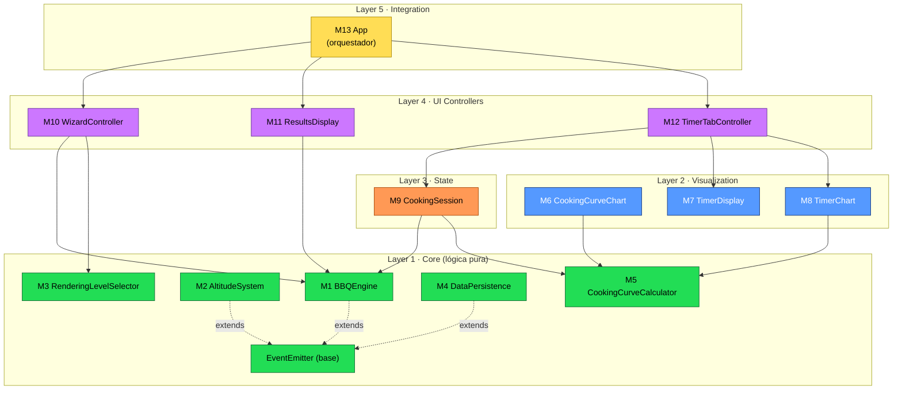
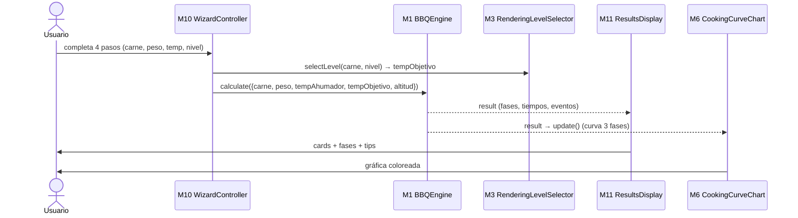
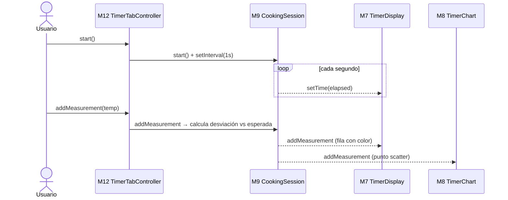

# 🗺️ Mapa Conceptual — BBQ Smoking Calculator

> Documento de orientación para **cualquier persona (o Claude) que vaya a editar el proyecto**.
> Explica **dónde está cada cosa**, **cómo fluyen los datos** y **qué reglas seguir**.
>
> Complemento de: `MODULAR_ARCHITECTURE.md` (referencia detallada módulo por módulo).

---

## 1. ¿Qué es esta app?

Calculadora de tiempos de ahumado BBQ. El usuario elige carne + peso + temperatura del ahumador y la app calcula:
- Tiempo total estimado (modelo de **3 fases**: Ramp-up → STALL → Renderización)
- Temperaturas internas objetivo (según nivel de terneza: Raro / Rosa / Gris)
- Curva de cocción visual + cronómetro en vivo con seguimiento real vs esperado
- Ajuste por altitud (+8% por cada 1000 m)

---

## 2. Mapa de Capas (arquitectura)



> [!regla] Dirección de dependencias
> Las flechas **solo bajan** (L5→L4→L3→L2→L1). Una capa **nunca** depende de una capa superior.
> Core no conoce DOM ni Chart.js. Si te ves importando algo "hacia arriba", el diseño está mal.

---

## 3. Flujo de datos principal (calcular)



## 4. Flujo de datos — cronómetro en vivo



---

## 5. ¿Dónde está cada cosa? (mapa de archivos)

```
bbq-calculator/
├── MAPA_CONCEPTUAL.md          ← ESTE documento (overview + diagramas)
├── MODULAR_ARCHITECTURE.md     ← referencia detallada módulo por módulo
├── DEPLOYMENT.md               ← instrucciones de deploy (Netlify)
├── README.md                   ← intro del proyecto
│
├── index.html                  ← ⚠️ MONOLITO original (4680 líneas) — aún vivo
│
└── src/
    ├── core/                   ← Layer 1 · lógica pura (sin DOM)
    │   ├── EventEmitter.js          base pub/sub
    │   ├── BBQEngine.js             M1 · cálculos + conversiones estáticas
    │   ├── AltitudeSystem.js        M2 · geolocalización/altitud
    │   ├── RenderingLevelSelector.js M3 · nivel terneza → temperatura
    │   ├── DataPersistence.js       M4 · RecipeStore + SessionStore (localStorage)
    │   └── CookingCurveCalculator.js M5 · fases → datos Chart.js
    │
    ├── viz/                    ← Layer 2 · Chart.js + DOM
    │   ├── CookingCurveChart.js     M6
    │   ├── TimerDisplay.js          M7
    │   └── TimerChart.js            M8
    │
    ├── state/                 ← Layer 3 · estado
    │   └── CookingSession.js        M9
    │
    ├── ui/                    ← Layer 4 · controladores
    │   ├── WizardController.js       M10
    │   ├── ResultsDisplay.js        M11
    │   └── TimerTabController.js     M12
    │
    ├── App.integrated.js      ← Layer 5 · M13 orquestador (scaffolding) 🔄
    │
    └── [legacy / otra estructura]
        ├── App.js, main.js
        ├── components/BBQCalculator.js
        └── utils/bbqFormulas.js
```

> [!warning] Coexistencia con el monolito
> El `index.html` monolítico y `src/utils/bbqFormulas.js` **siguen siendo el código en producción** hasta que [[MODULAR_ARCHITECTURE#M13 App]] esté cableado y el `index.html` migre a imports modulares.
> Los módulos nuevos en `src/{core,viz,state,ui}/` son la **arquitectura destino**, ya completa y testeada, pero todavía **no conectada** a la UI en vivo.

> [!note] Cada módulo tiene su test al lado
> `Foo.js` ⇄ `Foo.test.js` en la misma carpeta. Los tests corren con `node <archivo>.test.js` (runner casero, sin framework).

---

## 6. Reglas para editar (IMPORTANTE)

> [!regla] Estrategia "módulo congelado"
> 1. **Un módulo completo + testeado NO se vuelve a tocar.** ¿Funcionalidad nueva? → módulo nuevo.
> 2. **Una responsabilidad por módulo.** Si un archivo hace dos cosas, divídelo.
> 3. **Cero duplicación.** Conversiones de temperatura/peso viven SOLO en `BBQEngine` (métodos estáticos).
> 4. **Comunicación por eventos**, no llamadas directas entre módulos lejanos (`EventEmitter`).
> 5. **Core sin DOM.** Nada de `document`, `window`, `Chart`, `localStorage` en `src/core/`.
> 6. **Todo cambio en Core → test que lo cubra.** Mantener 100% verde.

### Antes de tocar algo, pregúntate:
- ¿En qué **capa** vive? (no subas dependencias)
- ¿Existe ya esa lógica en otro módulo? (no dupliques)
- ¿Rompo un módulo congelado? (mejor crea uno nuevo)
- ¿Corrí su `.test.js`? (debe quedar verde)

---

## 7. Estado actual

| Fase | Módulos | Estado |
|------|---------|--------|
| 1 Core | M1-M5 | ✅ Completo (93 tests) |
| 2 Viz | M6-M8 | ✅ Completo (61 tests) |
| 3 State | M9 | ✅ Completo (27 tests) |
| 4 UI | M10-M12 | ✅ Completo (79 tests) |
| 5 Integration | M13 | 🔄 Scaffolding |

**Total:** 13 módulos · 240 tests (100% verde) · 0 duplicación.

### Lo que falta (orden sugerido)
1. Cablear eventos en `App.integrated.js` (M13) — descomentar imports y `wireUpEventListeners()`.
2. Migrar `index.html` a imports de módulos (reemplazar monolito).
3. Tests e2e (Playwright).
4. (Opcional) TypeScript + publicar `BBQEngine` como paquete npm.

---

## 8. Referencias cruzadas

- Detalle por módulo → `MODULAR_ARCHITECTURE.md`
- Deploy → `DEPLOYMENT.md`
- Conceptos de dominio (3 fases, niveles, altitud) → sección "Conceptos de Dominio" en `MODULAR_ARCHITECTURE.md`

---

_Última actualización: 2026-06-22 · Rama `claude/merge-failure-latest-esr4oo`_
